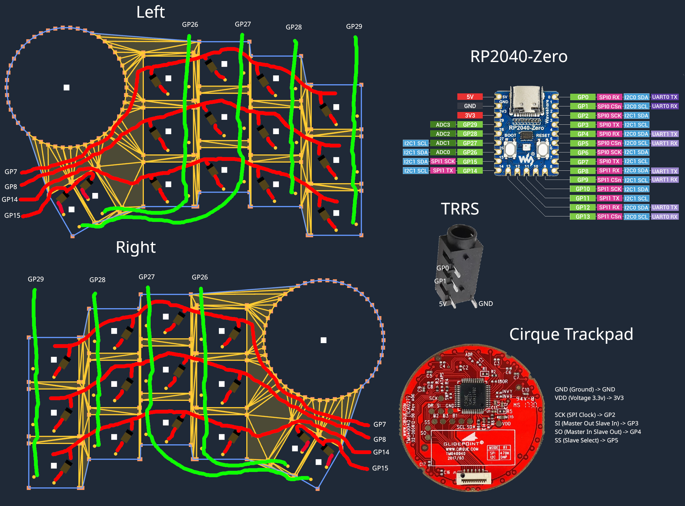
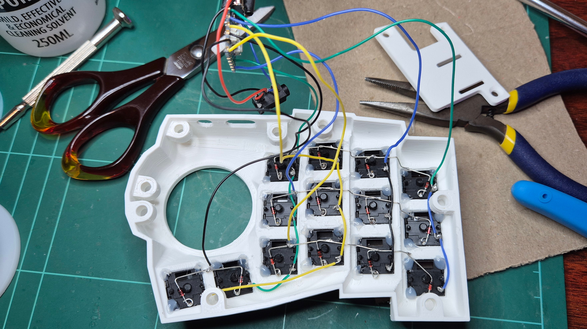

# Tengoku Build

## Parts

| Name                                                                                 | Qty | Link                                                                        |
| ------------------------------------------------------------------------------------ | --- | --------------------------------------------------------------------------- |
| RP2040 Zero MCU                                                                      | 2   | <https://www.aliexpress.com/item/1005007650325892.html>                     |
| M3 Heat Inserts 5mm Length, OD 4.5mm                                                 | 16  | <https://www.aliexpress.com/item/1005008897571758.html>                     |
| M3 x 5 mm Flat Head Screws for attaching the bottom plate                            | 10  | <https://www.aliexpress.com/item/1005007257158892.html>                     |
| M3 x 4 mm Flat Head Screws for attaching the microcontroller holder                  | 4   | <https://www.aliexpress.com/item/1005007257158892.html>                     |
| M3 x 8 mm Flat Head Screws for attaching microcontroller holder through bottom plate | 2   | <https://www.aliexpress.com/item/1005007257158892.html>                     |
| Choc v1 Switches (I like Ambients Nocturnal)                                         | 28  | <https://keebd.com/products/ambients-silent-linear-nocturnal-choc-switches> |
| Choc v1 Keycaps                                                                      | 28  | <https://chosfox.com/products/chocfox-cfx-choc-keycaps>                     |
| Cirque 40mm Trackpads TM040040-2024-302 with flat overlay                            | 2   | <https://au.mouser.com/ProductDetail/Cirque/TM040040-2024-302>              |
| 1N4148 Diodes                                                                        | 28  | <https://www.aliexpress.com/item/1005007807649334.html>                     |
| PJ-320A TRRS Connectors                                                              | 8   | <https://www.aliexpress.com/item/33029465106.html>                          |
| TRRS Cable                                                                           | 8   |                                                                             |
| Rubber or Silicone Feet                                                              | 8   |                                                                             |
| 30 AWG Flexible Silicone Wire                                                        | 1   | <https://www.aliexpress.com/item/1005007256968315.html>                     |

## Printed Parts

Printed parts are in the [cad](./cad/) folder. Printing the .stl files will give you a complete keyboard, but I have also made files for the case where the mcu holder screws are raised 0.5mm since I found it wouldn't sit flush with my prints.

## Wiring

[QMK Handwiring Guide](https://docs.qmk.fm/hand_wire)

## Firmware

[QMK](https://github.com/dlip/qmk_firmware/tree/dlip/keyboards/dlip/tengoku)
